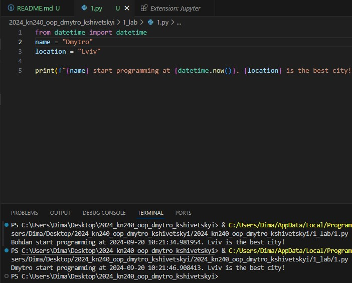
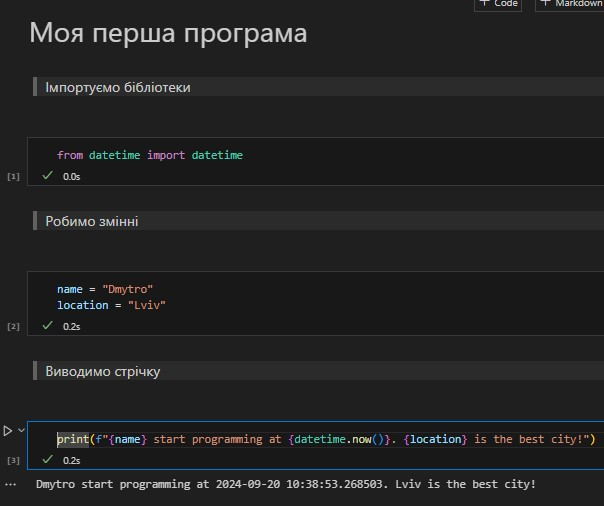
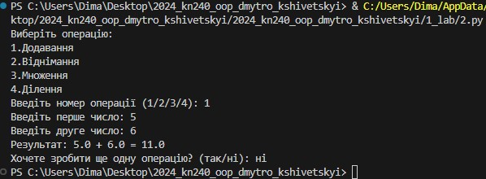

# Звіт до роботи 1
## Тема: _Вступ та налаштування середовища_
### Мета роботи: _Встановити необхідні програми,налаштувати локальне середовище розробки, створити власний репозиторій, попрацювати з форматуванням markdown та оформити звіт_

---
### Виконання роботи
* Результати виконання завдань:
    1. Встановили Python та Visual Studio Code;
    2. Створили власний репозиторі, посилання на нього [<<<тиць>>>](https://github.com/UraN9/2024_kn240_oop_dmytro_kshivetskyi);
    3. Створили початкову сторінку з допомогою ChatGPT;
    4. Навчилися працювати з Markdown;
    5. Доналаштували локальне середовище, встановили плагіни та пристуваємо до першої програми;

* Створили [Python файл](1.py), вставили код програми та запустили її. Результат виконання програми показано на скріншоті нижче:

    
* Продовжуємо роботу та виконувати програму у [Пайтон Ноутбуці](1.ipynb). Результат виконання представлений на скріншоті: 

    
* Результати виконання індувідуального завдання:
Запитав у ChatGPT яку б першу програму він написав, та чи б міг АІ пояснити її. Код програми від ChatGPT [тут](2.py) та пояснення далі нижче:

# Простий калькулятор на Python

Цей проєкт — це простий калькулятор, написаний на Python, який дозволяє виконувати базові арифметичні операції, такі як додавання, віднімання, множення та ділення. Програма має нескінченний цикл для багаторазового виконання операцій, доки користувач не вирішить завершити роботу.

## Як працює програма

### Операції, які підтримує калькулятор:
- ➕ Додавання
- ➖ Віднімання
- ✖ Множення
- ➗ Ділення (з перевіркою на ділення на нуль)

### Основні компоненти програми:

#### 1. Функції для арифметичних операцій
У програмі використовуються чотири функції, кожна з яких виконує певну математичну операцію:

```python
def add(x, y):
    return x + y

def subtract(x, y):
    return x - y

def multiply(x, y):
    return x * y

def divide(x, y):
    if y == 0:
        return "Ділення на нуль неможливе!"
    else:
        return x / y
```

* add(x, y): Додає два числа і повертає результат.
* subtract(x, y): Віднімає друге число від першого.
* multiply(x, y): Множить два числа.
* divide(x, y): Ділить перше число на друге. Якщо друге число — це нуль, програма поверне повідомлення про помилку, оскільки ділення на нуль заборонено.

#### 2. Вибір операції
Користувачеві пропонується вибрати операцію зі списку:

```python
print("Виберіть операцію:")
print("1.Додавання")
print("2.Віднімання")
print("3.Множення")
print("4.Ділення")
```

#### 3. Нескінченний цикл для обчислень
Програма працює в циклі while, що дозволяє користувачеві виконувати обчислення до тих пір, поки він не вирішить вийти з програми:

```python
while True:
    choice = input("Введіть номер операції (1/2/3/4): ")

    if choice in ['1', '2', '3', '4']:
        num1 = float(input("Введіть перше число: "))
        num2 = float(input("Введіть друге число: "))
```

* Користувач обирає операцію, після чого вводить два числа для обчислення.
* Введені числа обробляються як float для підтримки дробових значень.

#### 4. Виконання обчислень
Залежно від вибору користувача, програма викликає відповідну функцію і виводить результат:

```python
        if choice == '1':
            print(f"Результат: {num1} + {num2} = {add(num1, num2)}")

        elif choice == '2':
            print(f"Результат: {num1} - {num2} = {subtract(num1, num2)}")

        elif choice == '3':
            print(f"Результат: {num1} * {num2} = {multiply(num1, num2)}")

        elif choice == '4':
            print(f"Результат: {num1} / {num2} = {divide(num1, num2)}")
```

#### 5. Повторне обчислення
Після кожного обчислення користувач може обрати, чи хоче він продовжити обчислення або завершити програму:
```python
        next_calculation = input("Хочете зробити ще одну операцію? (так/ні): ")
        if next_calculation.lower() != 'так':
            break
```
Якщо користувач відповідає "так", цикл продовжується. Якщо ні — програма виходить із циклу і завершує роботу.

#### 6. Обробка помилок
Якщо користувач вводить неправильний варіант операції, програма повідомляє про помилку і пропонує спробувати ще раз:
```python
    else:
        print("Неправильний вибір. Спробуйте ще раз.")
```
Результат виконання:



---
### Висновок:

- :question: Що зроблено в роботі: Написали першу програму та навчились її запускати
- :question: Чи досягнуто мети роботи: Мета роботи досягнута
- :question: Які нові знання отримано: Ознайомися з Jupiter
- :question: Чи вдалось відповісти на всі питання задані в ході роботи: Так, вдалося
- :question: Чи вдалося виконати всі завдання: Вдалося виконати всі завдання
- :question: Чи виникли складності у виконанні завдання: Складностей не виникло
- :question: Чи подобається такий формат здачі роботи (Feedback): Так, такий формат здачі робіт мені до вподоби
- :question: Побажання для покращення (Suggestions): Немає

---