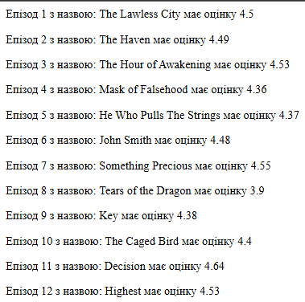

# Звіт до роботи 4
## Тема: _Віртуальні середовища_
### Мета роботи: _Ознайомитися з ізольованими середовищами у Python, встановленням та використанням сторонніх бібліотек, а також інструментами керування залежностями_

---
### Виконання роботи
### 1. Основи роботи з сторонніми бібліотеками
Для роботи з сторонніми бібліотеками їх потрібно спочатку встановити. Для їх встановлення є інструмент PIP (Python Install Package). Встановлюєм його та переконуємось чи він працює:

```bash
pip -V
pip --help
```

Після чого встановлюєм першу сторонню бібліотеку _**requests**_:

```bash
pip install requests
```

Та опробовуєм її в пайтон інтерпретаторі
```python
import requests
r = requests.get('https://google.com')
print (f"Повернув статус:{r.status_code}")
```
Та отримуємо результат:
```bash
Повернув статус:200
```

Також в бібліотеці _**requests**_ є такі методи:

1. **📄 Отримання HTML-коду сторінки:**
```python
r.text[:200]  # вивід перших 200 символів
```
2. **📦 Заголовки відповіді:**
```python
r.headers
```
3. **🍪 Cookies, отримані від сервера:**
```python
r.cookies
```
4. **📤 POST-запит:**
```python
r2 = requests.post('https://httpbin.org/post', data={'key': 'value'})
r2.json()
```
5. **🔁 PUT-запит:**
```python
requests.put('https://httpbin.org/put', data={'key': 'value'})
```
6. **❌ DELETE-запит:**
```python
requests.delete('https://httpbin.org/delete')
```

### Далі вводимо ці команди
```bash
pip show requests
pip install requests==2.1
pip show requests
pip uninstall requests
```
Ось результат кожної з них:
```bash
$ pip show requests
Name: requests
Version: 2.32.3
Summary: Python HTTP for Humans.
Home-page: https://requests.readthedocs.io
Author: Kenneth Reitz
Author-email: me@kennethreitz.org
License: Apache-2.0
Location: C:\Users\Dmytro\AppData\Local\Programs\Python\Python313\Lib\site-packages
Requires: certifi, charset-normalizer, idna, urllib3
Required-by:
```

```bash
$ pip install requests==2.1
Collecting requests==2.1
  Using cached requests-2.1.0-py2.py3-none-any.whl.metadata (30 kB)
Using cached requests-2.1.0-py2.py3-none-any.whl (445 kB)
Installing collected packages: requests
  Attempting uninstall: requests
    Found existing installation: requests 2.32.3
    Uninstalling requests-2.32.3:
      Successfully uninstalled requests-2.32.3
Successfully installed requests-2.1.0

[notice] A new release of pip is available: 24.3.1 -> 25.0.1
[notice] To update, run: python.exe -m pip install --upgrade pip
```

```bash
pip show requests
Name: requests
Version: 2.1.0
Summary: Python HTTP for Humans.
Home-page: http://python-requests.org
Author: Kenneth Reitz
Author-email: me@kennethreitz.com
License: Copyright 2013 Kenneth Reitz
Location: C:\Users\Dmytro\AppData\Local\Programs\Python\Python313\Lib\site-packages
Requires: 
Required-by: 
```

```bash
$ pip uninstall requests
Found existing installation: requests 2.1.0
Uninstalling requests-2.1.0:
  Would remove:
    c:\users\dmytro\appdata\local\programs\python\python313\lib\site-packages\requests-2.1.0.dist-info\*
    c:\users\dmytro\appdata\local\programs\python\python313\lib\site-packages\requests\*
Proceed (Y/n)? y
  Successfully uninstalled requests-2.1.0
```

Після встановлення бібліотек _**flask**_ і _**jikanpy**_ та виконання програми вказоної за [цим посиланням](https://github.com/BobasB/it_college/tree/main/notes/06_python_virtualenvs), вистрибнула помилка. Помилка в цьому коді виникла через те, що там використовувалась бібліотека _**jikanpy**_, яка працювала з Jikan API версії v3, яка зараз не дійсна.
Після виправлення помилки я запустив [цю програму](anime.py), запустився сервер за посиланням _http://127.0.0.1:5000/_, результат можна подивитись на цьому зображенні:



### 2. Робота з Pipenv
1. Щоб встановити **Pipenv** потрібно виконати ці команди:
```bash
pip install pipenv
# Після успішного виконання команди виконайте
pipenv --help
```
2. Ось які команди можна виконувати за допомогою **Pipenv**:
```bash
check           Checks for PyUp Safety security     vulnerabilities and against
                PEP 508 markers provided in Pipfile.
  clean         Uninstalls all packages not specified in Pipfile.lock.
  graph         Displays currently-installed dependency graph information.
  install       Installs provided packages and adds them to Pipfile, or (if no
                packages are given), installs all packages from Pipfile.
  lock          Generates Pipfile.lock.
  open          View a given module in your editor.
  requirements  Generate a requirements.txt from Pipfile.lock.
  run           Spawns a command installed into the virtualenv.
  scripts       Lists scripts in current environment config.
  shell         Spawns a shell within the virtualenv.
  sync          Installs all packages specified in Pipfile.lock.
  uninstall     Uninstalls a provided package and removes it from Pipfile.
  update        Runs lock, then sync.
  upgrade       Resolves provided packages and adds them to Pipfile, or (if no
                packages are given), merges results to Pipfile.lock
  verify        Verify the hash in Pipfile.lock is up-to-date.
```
3. Щоб створити нове середовище потрібно виконати ці команди:
```bash
pipenv --python 3.10
pipenv --venv
pipenv run python -V
pipenv install requests
```
4. Після виконання створюються два файли файли [Pipfile](./pipenv_env/Pipfile) та [Pipfile.lock](./pipenv_env/Pipfile.lock).
* Pipfile — містить інформацію про Python-версію та залежності.
* Pipfile.lock — фіксує точні версії залежностей.

5. Щоб запустити програму за допомогою командної стрічки, спочатку потрібно активувати середовище за допомоги цієї команди:
```bash
pipenv shell
```
після запустити саму програму за допомоги команди:
```bash
pipenv run python "назва прогрми"
```
після виконання цієї команди програма, [requests_test](./pipenv_env/requests_test.py), в результаті ми побачили вміст сторінки https://httpbin.org/ пострічково у байтах.

6. Вибрав бібліотеку _**emoji**_.
Бібліотека _**emoji**_ дозволяє працювати з емодзі в Python — додавати, знаходити, замінювати та перекодовувати смайлики.
Після виконання програми **emoji_test.py** ([код можна подивитись тут](./pipenv_env/emoji_test.py)), результатом було:
```bash
Python is 👍
True
I love :snake: and :hot_beverage:
```

7. Visual Studio дозволяє змінити Python інтерпретатор для запуску через кнопку Run (трикутник ▶️). Для цього потрібно викликати командну палітру з меню View -> Command Palette... та в ній наберіть Python: Select interpreter. Після чого Visual Studio відобразить всі доступні інтерпретатори.

### 3. Робота зі змінними середовища

Середовища також можна параметризувати за допомогою змінних середовища (Environment Variables). Для цього у папці повинен буди файл **.env** із заданими змінними у форматі **KEY=VALUE**. Pipenv автоматично розпізнає ці файли та робить їх доступними всередині середовища. Створюємо файл **.env** та виконуєсо наступний код:
```python
import os
os.environ['HELLO']
```
Якщо запустити скрипт через Pipenv то: Pipenv автоматично зчитує .env файл додає змінні в os.environ і os.environ['HELLO'] успішно поверне "world". Якщо запустити скрипт без активації середовища, то в такому разі змінна **HELLO** не буде доступною, і ти отримаєш: ```KeyError: 'HELLO'```, Тому що **.env** не зчитується автоматично стандартним інтерпретатором Python — тільки Pipenv робить це "з коробки".

### 4. Робота з Poetry

1. **poetry** — це сучасний інструмент для керування залежностями та пакетами в Python, який автоматично створює та керує віртуальними середовищами у проєктах.

2. Щоб створити новий проєкт, використовуйте команду:
```bash
poetry new myproject
```
* або якщо у вас вже є проєкт, ініціалізуйте poetry в його директорії:
```bash
cd myproject
poetry init
```
3. Для встановлення пакетів Python, наприклад, _**requests**_, потрібно виконати:
```bash
poetry add requests
```
```bash
# Результат виконання
$ poetry add requests
Creating virtualenv poetry-env-6RO8bzDW-py3.13 in C:\Users\Dmytro\AppData\Local\pypoetry\Cache\virtualenvs
The following packages are already present in the pyproject.toml and will be skipped:

  - requests

If you want to update it to the latest compatible version, you can use `poetry update package`.
If you prefer to upgrade it to the latest available version, you can use `poetry add package@latest`.

Nothing to add.
```

* Щоб побачити список усіх встановлених залежностей у вашому проєкті, потрібно виконати:
```bash
poetry show
```
```bash
# Результат виконання
$ poetry show
certifi            2025.1.31 Python package for providing Mozilla's CA Bundle.
charset-normalizer 3.4.1     The Real First Universal Charset Detector. Open, modern and actively maintained alternative to Chardet.
flake8             7.1.2     the modular source code checker: pep8 pyflakes and co
idna               3.10      Internationalized Domain Names in Applications (IDNA)
mccabe             0.7.0     McCabe checker, plugin for flake8
pycodestyle        2.12.1    Python style guide checker
pyflakes           3.2.0     passive checker of Python programs
requests           2.31.0    Python HTTP for Humans.
urllib3            2.3.0     HTTP library with thread-safe connection pooling, file post, and more.
```
* Для детального перегляду залежностей з їхніми версіями та описами:
```bash
poetry show --tree
```
```bash
# Результат виконання
$ poetry show --tree
flake8 7.1.2 the modular source code checker: pep8 pyflakes and co
├── mccabe >=0.7.0,<0.8.0
├── pycodestyle >=2.12.0,<2.13.0
└── pyflakes >=3.2.0,<3.3.0
requests 2.31.0 Python HTTP for Humans.
├── certifi >=2017.4.17
├── charset-normalizer >=2,<4
├── idna >=2.5,<4
└── urllib3 >=1.21.1,<3
```

* Щоб видалити залежність з проєкту, використовуйте команду:
```bash
poetry remove <package_name>
```
```bash
# Результат виконання
$ poetry remove requests
Updating dependencies
Resolving dependencies... (1.1s)

Package operations: 4 installs, 0 updates, 0 removals

  - Installing mccabe (0.7.0)
  - Installing pycodestyle (2.12.1)
  - Installing pyflakes (3.2.0)
  - Installing flake8 (7.1.2)

Writing lock file
```

* Щоб оновити всі залежності до їхніх останніх сумісних версій:
```bash
poetry update
```
```bash
# Результат виконання
$ poetry update
Updating dependencies
Resolving dependencies... (0.9s)

Package operations: 0 installs, 3 updates, 0 removals

  - Updating pycodestyle (2.12.1 -> 2.13.0)
  - Updating pyflakes (3.2.0 -> 3.3.2)
  - Updating flake8 (7.1.2 -> 7.2.0)

Writing lock file
```
* Для того щоб активувувати середовище _**poetry**_ потрібно ввести:
```bash
source <Шлях до середовища>
poetry env list
poetry env info
```

4. За допомогою АІ створив програму для цього проекту та запустив її у віртуальному середовищі створеному а допомогою _**poetry**_.

Спочатку встановив необхідні бібліотеки:
```bash
poetry add numpy pandas flask
```

після чого створив новий файл [main.py](./poetry_env/main.py) та запустив його за допомоги командного рядка:
```bash
poetry run python main.py

# Результат виконання
      Name  Age
0    Alice   25
1      Bob   30
2  Charlie   35
```

---
### Висновок:

- :question: Що зроблено в роботі: Навчилися встановлювати сторонні бібліотеки та працювати з віртуальними середовищами
- :question: Чи досягнуто мети роботи: Мета роботи досягнута
- :question: Які нові знання отримано: Дізнався про роботу в віртульних середовищах
- :question: Чи вдалось відповісти на всі питання задані в ході роботи: Так, вдалося
- :question: Чи вдалося виконати всі завдання: Вдалося виконати всі завдання
- :question: Чи виникли складності у виконанні завдання: Складності виникли з віртуальним середовище poetry, оскільки він оновлений і активація здійснюється вручну
- :question: Чи подобається такий формат здачі роботи (Feedback): Так, такий формат здачі робіт мені до вподоби
- :question: Побажання для покращення (Suggestions): Немає

---