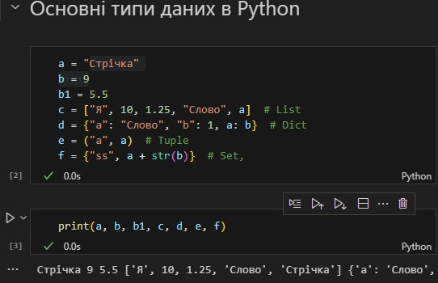
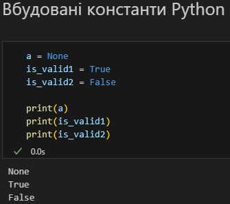
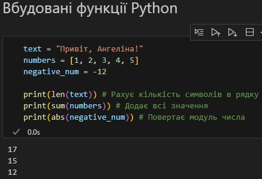
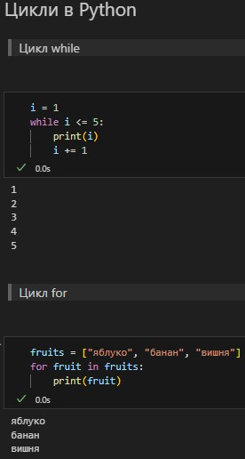
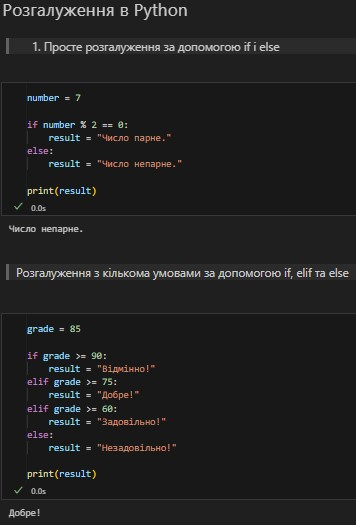
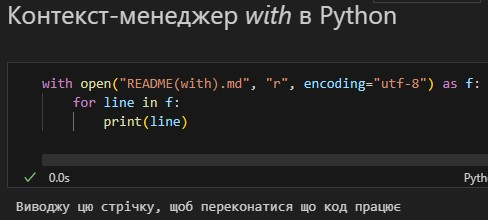
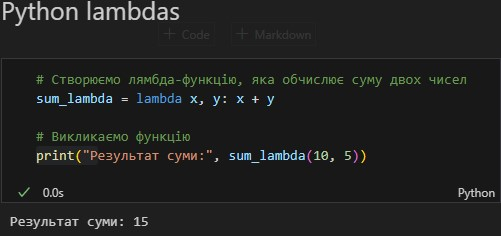

# Звіт до роботи 2
## Тема: _Основи програмування на Python_
### Мета роботи: _Ознайомитися з основними конструкціями в Python, створити Python файл *.py або .ipynb, познайомитимь з основними типами даних, вбудованими константи та з Python lambdas_

---
### Виконання роботи

* Результати виконання завдань:

    * ### Створив [Python ноутбук](2.2.ipynb) в якому буду виконувати базові приклади. Застосовуючи команду print виконав наступне:

    #### 1. Познайомився з основними типами даних та попракувався з простими змінними str та int, списками list, наборами set та словниками dict;

    

    #### 2. Вивів три вбудовані константи Python;

    

    #### 3. Вивів результат роботи трьох вбудованих функцій;

    

    #### 4. Познайомився з циклами та написав два приклади коду, які демонструють роботу циклів;

    

    #### 5. Познайомився з розгалуженнями та написав два коди, які демонструють роботу розгалужень;

    

    #### 6. Ознайомився з конструкією _try->except->finally_ та привів приклад коду;

    

    #### 7. Ознайомився з контекст-менеджером _with_, та написав свій приклад коду;

    

    #### 8. Познайомився з _Python lambdas_ та написав свій приклад коду;

    

    * ### Запитав в GhatGPT як би він розписав про основи Python. Виконання його прикладів коду я протестив у новому [Python ноутбуці](2.3.ipynb). Відповідь штучного інтелекту далі нижче:

    #### Основи Python включають ключові концепції програмування, які дозволяють ефективно працювати з мовою. Ось короткий огляд найважливіших аспектів:

    ## 1. Змінні та типи даних
    Python є мовою з динамічною типізацією, що означає, що типи даних не потрібно вказувати явно. Наприклад:

    ```python
    x = 5  # int
    y = 3.14  # float
    name = "Dima"  # str
    ```

    __Основні типи даних:__

    * __int__ – цілі числа.
    * __float__ – числа з плаваючою комою.
    * __str__ – рядки (текст).
    * __list__ – списки (колекції елементів).
    * __tuple__ – кортежі (незмінні списки).
    * __set__ – множини (унікальні елементи).
    * __dict__ – словники (пари "ключ-значення").

    ## 2. Оператори
    Оператори використовуються для виконання різних операцій над змінними:

    * __Арифметичні:__ +, -, *, /, //, %, **
    * __Порівняльні:__ ==, !=, >, <, >=, <=
    * __Логічні:__ and, or, not

    ## 3. Умовні конструкції
    Використовуються для виконання різних блоків коду в залежності від умов:

    ```python
    if x > 0:
        print("Positive")
    elif x == 0:
        print("Zero")
    else:
        print("Negative")
    ```

    ## 4. Цикли
    Цикли дозволяють повторювати блоки коду:

    * __for__ – перебір елементів колекції:

    ```python
    for i in range(5):
        print(i)
    ```
    * __while__ – виконується доти, поки умова є істинною:

    ```python
    while x > 0:
        x -= 1
    ```

    ## 5. Функції
    Функції дозволяють структурувати код, роблячи його більш читабельним і повторно використовуваним:

    ```python
    def greet(name):
        return f"Hello, {name}!"

    print(greet("Dima"))
    ```

    ## 6. Обробка помилок
    Можна використовувати блоки _try-except_ для обробки виняткових ситуацій:

    ```python
    try:
        result = 10 / 0
    except ZeroDivisionError:
        print("Cannot divide by zero")
    ```

    ## 7. Модулі та бібліотеки
    Python має велику кількість вбудованих модулів, які можна підключати за допомогою import. Наприклад, для роботи з випадковими числами:

    ```python
    import random
    print(random.randint(1, 10))
    ```

    ## 8. Спискові включення (List comprehensions)
    Спрощений спосіб створення списків:

    ```python
    squares = [x**2 for x in range(10)]
    ```
    Ці основи формують фундамент Python, і розуміння цих концепцій дозволяє писати ефективний код та розвивати більш складні програми.

---
### Висновок:

#### У ході виконання лабораторної роботи я ознайомився з основними конструкціями мови Python, такими як змінні, оператори, умовні вирази, цикли та функції. Я вивчив основні типи даних, зокрема int, float, str, list, tuple, set, і dict, та навчився працювати з ними в середовищі Python.
#### Крім того, я створив Python-файл у форматі .ipynb для практичного закріплення знань і успішно реалізував приклади коду з використанням вбудованих функцій та констант. Особливо цікавим було ознайомлення з функціями-лямбдами, які дозволяють створювати анонімні функції на місці, що робить код більш лаконічним.
#### Отже, я отримав практичні навички роботи з Python та зрозумів базові концепції програмування на цій мові, що стане міцною основою для подальшого вивчення і розробки складніших програм.
---